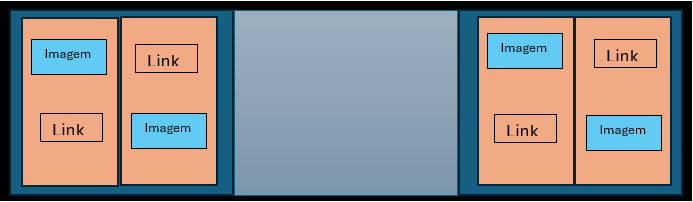

## Sumário
O trabalho proposto para esta semana consistia na elaboração de uma página web, construída utilizando html e css, acerca de um tema ou hobby desejado. O tema escolhido para este trabalho foi desastres aéreos.

## Decisões de Implementação
A página desenvolvida possuí dois componentes principais, o header e o body. 
O header corresponde à faixa presente no topo da página que contem uma disposição de imagens, links e título principal da página. Esta disposição foi conseguida dividindo o *div* correspondente ao header em três *divs* distintos. De seguida, os *divs* da esquerda e direita, que no código correspondem ao primeiro e ao último, foram divididos em mais dois *divs* para criarem duas colunas, nas quais foram inseridos uma imagem e um parágrafo (a ordem é alternada para criar um efeito de xadrez). 

Utilizando a propriedade *display* do elemento *div* foi possível alterar a disposição dos elementos. O *div* que corresponde ao header, e que possui o mesmo nome de class, tem como valor de *display* “grid” de forma que os 3 *div* que envolve fiquem alinhados horizontalmente.

Do mesmo modo, os *divs* que pertencem à class “imagens” também têm como valor de *display* o grid, por forma a que os dois *divs* interiores, “colunas”, fiquem alinhados horizontalmente. Por outro lado, os *divs* “colunas” utilizando o valor block de forma que os seus elementos, uma imagem e uma ancora/parágrafo, fiquem alinhados verticalmente. 

Deste modo foi possivel criar um header com o seguinte esquema:

No que se refere ao corpo da página, este está dividido em 4 secções que correspondem aos links presentes no header. Cada uma destas secções possui mais do que um acidente aéreo, sendo que cada um corresponde a um elemento *div*. Este *div* (class="acidentes"), configurado como grid, é constituído por uma imagem ilustradora do acidente e um outro *div*, que engloba dois parágrafos, um com a descrição do acidente e o outro com as causas do acidente.

## Funcionalidades Interessantes 
Como referido anteriormente, o header da página contem links que permitem saltar para as diferentes secções da página e foi conseguido utilizando o elemento âncora do html.

Para além disso, as imagens que ilustram cada acidente funcionam como links para a página Wikipédia (era a fonte de informação mais fácil) do respetivo acidente.